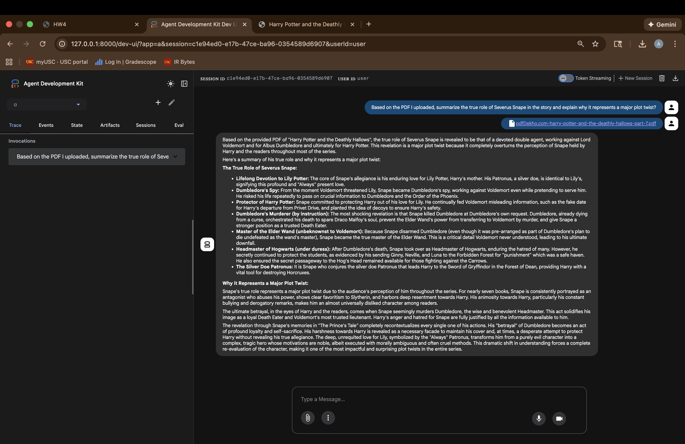
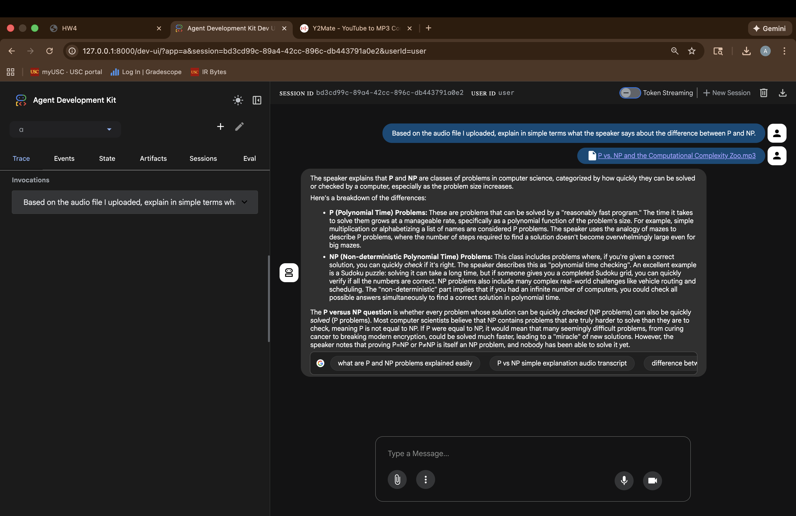
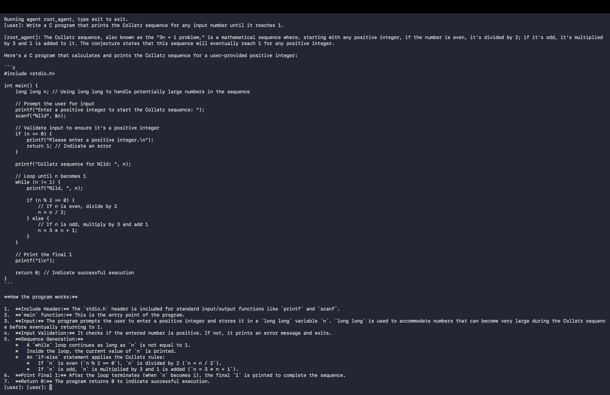

# 🤖 Agentic AI & Multimodal RAG System using Google ADK

An **Agentic AI and Retrieval-Augmented Generation (RAG)** project built using **Google's Agent Development Kit (ADK)** and a Gemini model.

This project demonstrates how to create, run, and interact with an AI agent through both the **command line** and a **browser-based interface**, including multimodal RAG using uploaded PDF, image, and audio content.

## 🚀 Project Overview

The goal of this project is to build a simple but extensible AI agent using Google's ADK.

The agent can:

* Answer general user questions
* Use Google Search as a tool
* Generate code from natural-language prompts
* Answer questions about uploaded documents
* Analyze uploaded images
* Process uploaded audio
* Interact through a browser-based agent interface

The project demonstrates the core concepts behind **agentic AI** and **multimodal RAG** using the Google ADK framework.

## 🧠 What is Agentic RAG?

Traditional Retrieval-Augmented Generation typically follows:

```text
User Query
    ↓
Retrieve Information
    ↓
Generate Answer
```

Agentic RAG extends this approach by allowing an AI agent to reason about the task and decide how to use available tools and sources.

```text
                ┌───────────────────┐
                │    User Query     │
                └─────────┬─────────┘
                          │
                          ▼
                ┌───────────────────┐
                │    AI Agent       │
                │   Gemini + ADK    │
                └─────────┬─────────┘
                          │
              ┌───────────┼────────────┐
              ▼           ▼            ▼
        Google Search   PDF/Image    Audio
              │           │            │
              └───────────┼────────────┘
                          ▼
                ┌───────────────────┐
                │    Generated      │
                │      Answer       │
                └───────────────────┘
```

## 🛠️ Technologies Used

* **Python 3.10+**
* **Google ADK (Agent Development Kit)**
* **Gemini**
* **Google Search Tool**
* **Retrieval-Augmented Generation (RAG)**
* **Multimodal AI**
* **Virtual Environments**
* **Command-Line Agent Interface**
* **Browser-Based ADK Web Interface**

## ✨ Features

### 🤖 AI Agent

The project uses Google's ADK to define a root agent with a Gemini model.

The agent is configured with:

```python
root_agent = Agent(
    model='gemini-2.5-flash',
    name='root_agent',
    description='A helpful assistant for user questions.',
    instruction='Answer user questions to the best of your knowledge.',
    tools=[google_search]
)
```

Google ADK expects an `agent.py` file containing a `root_agent` definition.

### 🔎 Google Search Tool

The agent can use the Google Search tool to obtain information when answering user questions.

This demonstrates the integration of external tools into an AI agent rather than relying solely on the model's internal knowledge.

### 💻 Command-Line Interaction

The agent can be launched from the terminal using:

```bash
adk run <yourFolder>
```

This provides an interactive prompt where users can send natural-language questions and receive responses from the agent.

### 🌐 Browser-Based Agent Interface

The agent can also be launched through the ADK web interface:

```bash
adk web
```

The browser interface runs locally and provides a graphical interface for interacting with the agent.

## 📚 RAG Demonstrations

The project demonstrates multimodal retrieval-augmented interaction using uploaded files.

### 📄 PDF RAG

A PDF is uploaded to the browser interface and the agent is asked a question whose answer is contained in the document.



### 🖼️ Image RAG

An image is uploaded and the agent is asked questions about its content.


### 🎵 Audio RAG

An audio file is uploaded and the agent is prompted to analyze or answer questions based on the audio content.



The assignment explicitly demonstrates using PDF, image, and MP3 uploads for RAG-style interactions.

## 💻 Command-Line Demonstrations

### 👨‍💻 Code Generation

The command-line agent was tested with a code-generation task.



### 🗺️ MapReduce / Technical Question

A second command-line prompt was used to evaluate the agent on a technical MapReduce-related question.


The assignment requires two different command-line prompts and their outputs.

## 📁 Project Structure

```text
agentic-rag-google-adk/
│
├── README.md
├── .gitignore
├── .env.example
├── agent.py
├── __init__.py
│
└── screenshots/
    ├── command-line-code-generation.png
    ├── command-line-mapreduce.png
    ├── rag-pdf.png
    ├── rag-image.png
    └── rag-audio.png
```

## ⚙️ Setup

### 1. Create a Virtual Environment

Using Python:

```bash
python -m venv ADK_stuff
```

Activate the environment before installing dependencies. The assignment requires Python 3.10 or newer.

### 2. Install Google ADK

```bash
pip install google-adk
```

The assignment uses the `google-adk` Python package.

### 3. Configure Environment Variables

Create a `.env` file:

```env
GOOGLE_GENAI_USE_VERTEXAI=0
GOOGLE_API_KEY=your_google_api_key
```

> [!IMPORTANT]
> Never commit the real `.env` file or Google API key to GitHub.

You can use `.env.example` as a template:

```env
GOOGLE_GENAI_USE_VERTEXAI=0
GOOGLE_API_KEY=your_google_api_key_here
```

## ▶️ Running the Agent

### Command Line

Run:

```bash
adk run <yourFolder>
```

The folder should contain:

```text
.env
agent.py
__init__.py
```

### Browser

Run:

```bash
adk web
```

Then open the local ADK web interface, typically at:

```text
http://127.0.0.1:8000
```

The browser interface provides the environment used for the RAG demonstrations.

## 📸 Screenshots

### Command-Line Prompt 1 — Code Generation


### Command-Line Prompt 2 — MapReduce


### RAG — PDF


### RAG — Image


### RAG — Audio


## 🧪 Experiments

The project demonstrates several categories of agent interaction:

| Experiment          | Interface    | Input                                |
| ------------------- | ------------ | ------------------------------------ |
| Code generation     | Command line | Natural-language programming request |
| Technical reasoning | Command line | MapReduce-related question           |
| Document RAG        | Browser      | PDF                                  |
| Visual RAG          | Browser      | Image                                |
| Audio RAG           | Browser      | Audio                                |

The assignment requires two command-line demonstrations and three RAG demonstrations through the browser.

## 💡 What I Learned

Through this project, I gained hands-on experience with:

* Building an AI agent using Google ADK
* Defining a `root_agent`
* Working with Gemini models
* Integrating external tools into an AI agent
* Using Google Search as an agent tool
* Running agents from the command line
* Running agents through a browser interface
* Understanding the basic architecture of agentic AI
* Applying Retrieval-Augmented Generation concepts
* Working with multimodal inputs
* Using uploaded PDFs as retrieval context
* Analyzing images with a multimodal model
* Working with audio-based prompts
* Managing API credentials through environment variables
* Using Python virtual environments

## 🔐 Security

The Google API key is stored in an environment variable and should never be committed to version control.

Use:

```text
.env
```

for local secrets and:

```text
.env.example
```

for a safe template.

## 🚀 Future Improvements

Possible extensions include:

* Multi-agent workflows
* Additional ADK tools
* Custom retrieval pipelines
* Vector databases
* Persistent conversation memory
* More advanced document ingestion
* Structured tool calling
* Agent-to-agent communication
* Evaluation and benchmarking of RAG responses

The assignment notes that ADK can be extended toward multi-agent systems and frameworks such as A2A and CrewAI.

## 👤 Author

**YOUR NAME**

* **LinkedIn:** [LinkedIn Profile](https://www.linkedin.com/in/aryansindhu/)
* **GitHub:** [GitHub Profile](https://github.com/aryansindhu8/)

---

⭐ If you found this project interesting, feel free to star the repository.
